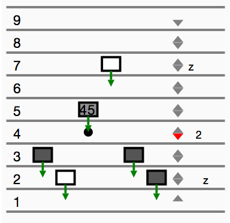

# Elevator model for Runway

[try this model in Runway](https://runway.systems/?model=github.com/salesforce/runway-model-elevators)

This models a typical bank of elevators in a building. People want to go to
different floors and ride the elevators to get there. It's an example of a
problem that benefits from both visualization and simulation.

This code meant to be used in
[Runway](https://github.com/salesforce/runway-browser), a tool for
simulating and visualizing concurrent and distributed system models.
